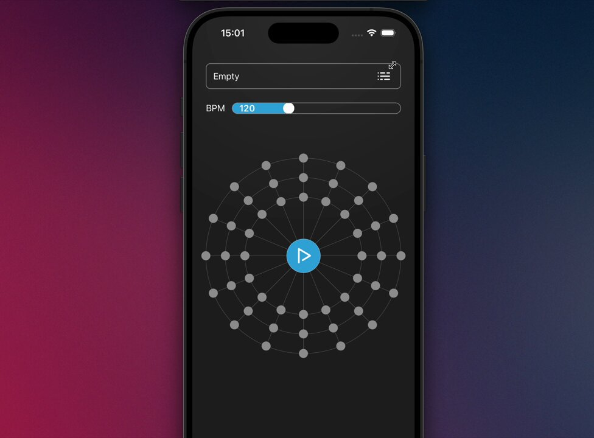

### ⚠️ Early version warning!

This library is at a very early stage of development. There are known performance issues and the library might not yet suitable for real production applications.

### React Native Audio API

`react-native-audio-api` provides system for controlling audio in React Native environment compatible with Web Audio API specification,
allowing developers to generate and modify audio in exact same way it is possible in browsers.

## Installation

1. Install `react-native-audio-api` library

   ```bash
   # using npm
   npm install react-native-audio-api

   # or using yarn
   yarn add react-native-audio-api
   ```

## Documentation

`react-native-audio-api` tries to strictly follow the Web Audi API specification, which can be found at [https://www.w3.org/TR/webaudio/](https://www.w3.org/TR/webaudio/).
<br />
[MDN Web Docs](https://developer.mozilla.org/en-US/docs/Web/API/Web_Audio_API) is useful resource to get familiar with audio processing basics.

## Coverage

Our current coverage of Web Audio API specification can be found here: [Web Audio API coverage](./docs/web-audio-coverage.md).

## Examples

<div align="center">

<a href="https://www.youtube.com/watch?v=npALr9IIDkI" target="_blank" rel="noopener noreferrer">
  
</a>

</div>

The source code for the example application is under the [`/apps/common-app`](./apps/common-app/) directory. If you want to play with the API but don't feel like trying it on a real app, you can run the example project. Check [Example README](./apps/common-example/README.md) for installation instructions.

## Your feedback

We are open to new ideas and general feedback. If you want to share your opinion about `react-native-audio-api` or have some thoughts about how it could be further developed, don't hesitate to create an issue or contact the maintainers directly.

## License

react-native-audio-api library is licensed under [The MIT License](./LICENSE). Some of the source code uses implementation directly copied from Webkit and copyrights are held by respective organizations, check [COPYING](./COPYING) file for further details

## Credits

This project has been built and is maintained thanks to the support from [Software Mansion](https://swmansion.com)

[](https://swmansion.com)

## Community Discord

<a href="https://discord.swmansion.com" target="_blank" rel="noopener noreferrer">Join the Software Mansion Community Discord</a> to chat about React Native Audio API or other Software Mansion libraries.

## react-native-audio-api is created by Software Mansion

Since 2012 [Software Mansion](https://swmansion.com) is a software agency with experience in building web and mobile apps. We are Core React Native Contributors and experts in dealing with all kinds of React Native issues. We can help you build your next dream product – [Hire us](https://swmansion.com/contact/projects?utm_source=reanimated&utm_medium=readme).
