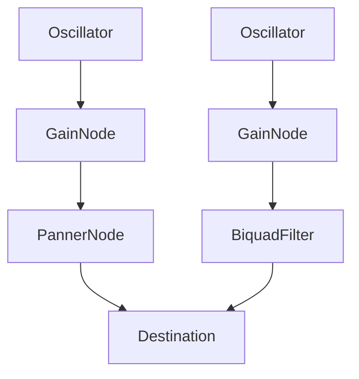

# React Native Audio Context

## Project goal

The main goal of the project is to recreate the Web Audio API as accurate as possible in the React Native environment.

## Interfaces

The document introduces the basic interfaces of React Native Audio Context library.

1. [AudioContext](#audiocontext)
2. [AudioNode](#audionode)
3. [AudioScheduledSourceNode](#audioscheduledsourcenode)
4. [AudioDestinationNode](#audiodestinationnode)
5. [AudioParam](#audioparam)
6. [OscillatorNode](#oscillatornode)
7. [GainNode](#gainnode)
8. [StereoPannerNode](#stereopannernode)
9. [BiquadFilterNode](#biquadfilternode)

### AudioContext

The `AudioContext` interface is the underlying audio context that manages the state of the entire audio application. It controls both the creation of nodes and the execution of audio processing. You have to create it at first, because everything happens inside it. It is recommended to create one `AudioContext` instance ane reuse it.

#### Constructor

&ensp;**`AudioContext()`**<br>
&ensp;&ensp;&ensp;*Creates and returns new AudioContext instance*


#### Properties

&ensp;**`destination`**<br>
&ensp;&ensp;&ensp;*Returns an `AudioDestinationNode` representing final destination of all audio in the context.*

&ensp;**`sampleRate`**<br>
&ensp;&ensp;&ensp;*Returns a floating point number representing sample rate, in samples per second used by all nodes in this audio context*

&ensp;**`currentTime`**<br>
&ensp;&ensp;&ensp;*Returns a floating point number representing an ever-increasing hardware time in seconds. It starts at 0.*

&ensp;**`state`**<br>
&ensp;&ensp;&ensp;*Returns a current state of this audio context. There are two states: running and closed.*

#### Methods

&ensp;**`createGain()`**<br>
&ensp;&ensp;&ensp;*Returns and creates `GainNode`.*

&ensp;**`createOscillator()`**<br>
&ensp;&ensp;&ensp;*Returns and creates `OscillatorNode`.*

&ensp;**`createStereoPannerNode()`**<br>
&ensp;&ensp;&ensp;*Returns and creates `StereoPannerNodeNode`.*

&ensp;**`createBiquadFilter()`**<br>
&ensp;&ensp;&ensp;*Returns and creates `BiquadFilterNode`.*

&ensp;**`close()`**<br>
&ensp;&ensp;&ensp;*Closes audio context, releasing any system resources that it uses.*

#### Code snippets

```js
const audioContext = new AudioContext();

const oscillator = audioContext.createOscillator();
const gain = audioContext.createGain();
const panner = audioContext.createStereoPannerNode();

const destination = audioContext.destination;
```

---

### AudioNode

The `AudioNode` interface is the generic interface for all audio nodes in the audio processing graph.

#### Properties

&ensp;**`context`**<br>
&ensp;&ensp;&ensp;*Returns the `AudioContext` associated with this node.*

&ensp;**`numberOfInputs`**<br>
&ensp;&ensp;&ensp;*Returns the number of inputs feeding the node. Source nodes are defined as nodes having value 0 for this property*

&ensp;**`numberOfOutputs`**<br>
&ensp;&ensp;&ensp;*Returns the number of outputs coming out of the node. Destination nodes are defined as nodes having value 0 for this property*

#### Methods

&ensp;**`connect(node: AudioNode)`**<br>
&ensp;&ensp;&ensp;*Connects the current node to another audio node.*

&ensp;**`disconnect(node: AudioNode)`**<br>
&ensp;&ensp;&ensp;*Disconnects the current node from another audio node.*

#### Code snippets

```js
const oscillator = audioContext.createOscillator();
const gain = audioContext.createGain();

oscillator.connect(gain);
gain.connect(audioContext.destination);
```

#### Processing Graph

Processing graph - a graph, or more precisely, a chain of interconnected nodes through which the audio signal flows. Each node can be independently configured and connected to other nodes.




The example graph consists of two oscillators. The first of them is equipped with GainNode and PannerNode, which allows you to control the volume and panning of the sound. Second one is connected to GainNode and BiquadFilter, providing simple low-order filtering. Both oscillators are connected to destination, which means they will be heard at the same time

---

### AudioScheduledSourceNode

The `AudioScheduledSourceNode` is an interface representing several types of audio source node. Inherits from `AudioNode`.

#### Methods

&ensp;**`start(time: number)`**<br>
&ensp;&ensp;&ensp;*Schedules the node to begin playback at specified time. If no time is given, starts immediately.*

&ensp;**`stop(time: number)`**<br>
&ensp;&ensp;&ensp;*Schedules the node to stop playing at specified time. If no time is given, stops immediately.*

#### Code snippets

```js
oscillator.start(audioContext.currentTime)
oscillator.stops(audioContext.currentTime + 0.5)
```

---

### AudioDestinationNode

The `AudioDestinationNode` is an interface representing the final destination of audio graph. Inherits from `AudioNode`.

---

### AudioParam

The `AudioParam` interface represents audio parameters that can be time-modulated.

#### Properties

&ensp;**`value`**<br>
&ensp;&ensp;&ensp;*Returns the current value of this parameter. Initially set to defaultValue.*

&ensp;**`defaultValue`**<br>
&ensp;&ensp;&ensp;*Returns the initial value of this parameter.*

&ensp;**`minValue`**<br>
&ensp;&ensp;&ensp;*Returns the minimum value of this parameter*

&ensp;**`maxValue`**<br>
&ensp;&ensp;&ensp;*Returns the maximum value of this parameter*

#### Methods

&ensp;**`setValueAtTime(value: number, startTime: number)`**<br>
&ensp;&ensp;&ensp;*Sets the parameter `value` at the specified time given by `startTime`.*

&ensp;**`linearRampToValueAtTime(value: number, endTime: number)`**<br>
&ensp;&ensp;&ensp;*Schedules a gradual linear change in the value. New `value` will be reached in the `endTime`.*

&ensp;**`exponentialRampToValueAtTime(value: number, endTime: number)`**<br>
&ensp;&ensp;&ensp;*Schedules a gradual exponential change in the value. New `value` will be reached in the `endTime`.*

#### Code snippets

```js
gain.gain.setValueAtTime(1.0, time);
gain.gain.exponentialRampToValueAtTime(0.01, time + 0.5);
```

---

### OscillatorNode

The `OscillatorNode` interface represents an oscillator node that generates sounds at a specific frequency and waveform. Inherits from `AudioScheduledSourceNode`.

#### Constructor

&ensp;**`AudioContext.createOscillator()`**<br>
&ensp;&ensp;&ensp;*Returns and creates `OscillatorNode` instance in given `AudioContext`.*

#### Properties

&ensp;**`frequency`**<br>
&ensp;&ensp;&ensp;*Returns `AudioParam` representing the frequency of oscillation in hertz.*

&ensp;**`detune`**<br>
&ensp;&ensp;&ensp;*Returns `AudioParam` representing detuning of oscillation in cents.*

&ensp;**`type`**<br>
&ensp;&ensp;&ensp;*Returns string representing shape of waveform to play. Available values: `"sine"`, `"square"`, `"sawtooth"`, `"triangle"`.*

#### Code snippets

```js
const oscillator = audioContext.createOscillator();
oscillator.frequency.value = 800;
oscillator.detune.value = 30;
oscillator.type = "sawtooth";

oscillator.start();
```

---

### GainNode

The `GainNode` interface represents a gain node that allows you to control the volume of the audio signal. Inherits from `AudioNode`.

#### Constructor

&ensp;**`AudioContext.createGain()`**<br>
&ensp;&ensp;&ensp;*Returns and creates `GainNode` instance in given `AudioContext`.*

#### Properties

&ensp;**`gain`**<br>
&ensp;&ensp;&ensp;*Returns `AudioParam` representing the amount of gain to apply. Gain value has to be in range <0,1>.*

#### Code snippets

```js
const gain = audioContext.createGain();
gain.gain.value = 0.5;
```

---

### StereoPannerNode

The `StereoPannerNode` interface represents a stereo panning node that allows you to control the position of sound in stereo space. Inherits from `AudioNode`.

#### Constructor

&ensp;**`AudioContext.createStereoPanner()`**<br>
&ensp;&ensp;&ensp;*Returns and creates `StereoPannerNode` instance in given `AudioContext`.*

#### Properties

&ensp;**`pan`**<br>
&ensp;&ensp;&ensp;*Returns `AudioParam` representing the amount of panning to apply. Pan value has to be in range <-1,1>. `-1`- full left, `1`- full right.*

#### Code snippets

```js
const panner = audioContext.createStereoPanner();
panner.pan.value = -0.5;
```

---

### BiquadFilterNode

The `BiquadFilterNode` interface represents a simple low-order filter. It can represent different kinds of filters, tone control devices, and graphic equalizers

#### Constructor

&ensp;**`AudioContext.createBiquadFilter()`**<br>
&ensp;&ensp;&ensp;*Returns and creates `BiquadFilterNode` instance in given `AudioContext`.*

#### Properties

&ensp;**`frequency`**<br>
&ensp;&ensp;&ensp;*Returns `AudioParam` representing a frequency in the current filtering algorithm measured in hertz.*

&ensp;**`detune`**<br>
&ensp;&ensp;&ensp;*Returns `AudioParam` representing detuning of the frequency in cents.*

&ensp;**`Q`**<br>
&ensp;&ensp;&ensp;*Returns `AudioParam` representing the quality factor.*

&ensp;**`gain`**<br>
&ensp;&ensp;&ensp;*Returns `AudioParam` representing the gain used in the current filtering algorithm.*

&ensp;**`type`**<br>
&ensp;&ensp;&ensp;*A string value defining the kind of filtering algorithm the node is implementing. Available values: `"low pass"`, `"high pass"`, `"bandpass"`, `"lowshelf"`, `"highshelf"`, `"peaking"`, `"notch"`, `"allpass"` .*

#### Code snippets

```js
const filter = audioContext.createBiquadFilter();
filter.type = "highpass";
filter.frequency.value = 1000;
filter.gain.linearRampToValueAtTime(0.001, audioContext.currentTime + 0.5);
```
