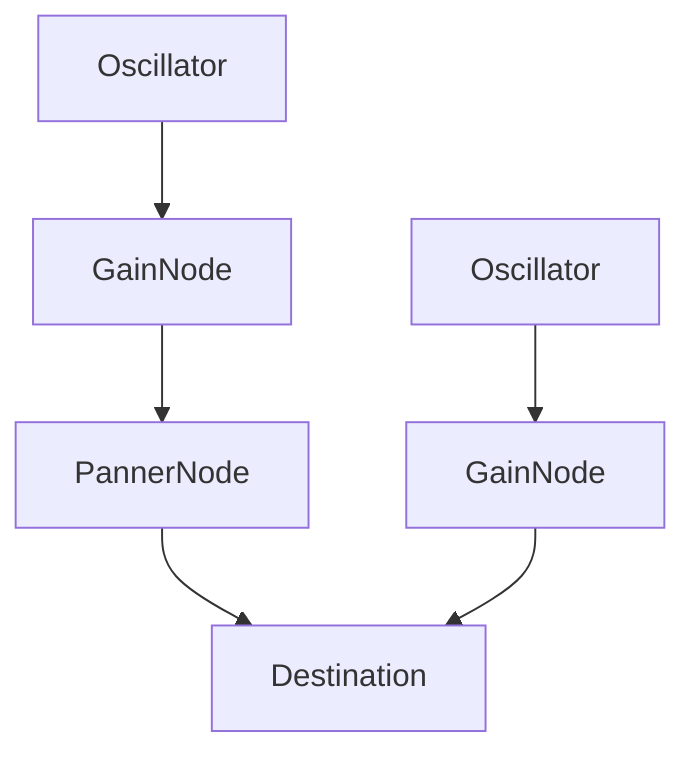

# React Native Audio Context

## Project goal

The main goal of the project is to reproduce the Web Audio API as accurate as possible in the React Native environment.

## Interfaces

The document introduces the basic interfaces that we want to recreate.

1. [AudioContext](#audiocontext)
2. [AudioNode](#audionode)
3. [AudioScheduledSourceNode](#audioscheduledsourcenode)
4. [AudioDestinationNode](#audiodestinationnode)
5. [AudioParam](#audioparam)
6. [OscillatorNode](#oscillatornode)
7. [GainNode](#gainnode)
8. [StereoPannerNode](#stereopannernode)

### AudioContext

The `AudioContext` interface is the underlying audio context that manages the state of the entire audio application.

#### Attributes

- **`currentTime`**: Representing an ever-increasing hardware time in seconds. It starts at 0.
- **`destination`**: Output node that is typically connected to speakers.
- **`sampleRate`**: Audio sampling rate in hertz.

#### Methods

- **`createBuffer()`**: Creates the audio buffer.
- **`createGain()`**: Creates a gain node.
- **`createOscillator()`**: Creates an oscillator node.
- **`createStereoPanner()`**: Creates a stereo panning node.

### AudioNode

The `AudioNode` interface is the base interface for all audio nodes in the audio processing graph.

#### Attributes

- **`context`**: Context associated with AudioNode.
- **`numberOfInputs`**: Number of inputs feeding the node. Source nodes are defined as nodes having value 0 for this attribute
- **`numberOfOutputs`**: Number of outputs coming out of the node. Destination nodes are defined as nodes having value 0 for this attribute

#### Methods

- **`connect(destination, output, input)`**: Connects the current audio node to another audio node or parameter.
- **`disconnect(destination, output, input)`**: Disconnects the current audio node from another audio node or parameter.

### AudioScheduledSourceNode

The `AudioScheduledSourceNode` is an interface representing several types of audio source node. Inherits from `AudioNode`.

#### Methods

- **`start(time)`**: Schedules the node to begin playback at specified time. If no time is given, starts immediately.
- **`stop(time)`**: Schedules the node to stop playing at specified time. If no time is given, stops immediately.

### AudioDestinationNode

The `AudioDestinationNode` is an interface representing end destination of audio graph. Inherits from `AudioNode`.

### AudioParam

The `AudioParam` interface represents audio parameters that can be time-modulated.

#### Attributes

- **`value`**: The current value of the parameter.

#### Methods

- **`setValueAtTime(value, startTime)`**: Sets the parameter value at the specified time.
- **`linearRampToValueAtTime(value, endTime)`**: Linearly ramps the value of a parameter to a specified value in a specified time.
- **`exponentialRampToValueAtTime(value, endTime)`**: Exponentially changes the value of a parameter to the specified value over the specified time.

### OscillatorNode

The `OscillatorNode` interface represents an oscillator node that generates sounds at a specific frequency and waveform. Inherits from `AudioScheduledSourceNode`.

#### Attributes

- **`frequency`**: `AudioParam` - frequency parameter.
- **`detune`**: `AudioParam` - detune parameter.
- **`type`**: wave type (`sine`, `square`, `sawtooth`, `triangle`).

### GainNode

The `GainNode` interface represents a gain node that allows you to control the volume of the audio signal. Inherits from `AudioNode`.

#### Attributes

- **`gain`**: `AudioParam` - gain parameter.

### StereoPannerNode

The `StereoPannerNode` interface represents a stereo panning node that allows you to control the position of sound in stereo space. Inherits from `AudioNode`.

#### Attributes

- **`pan`**: `AudioParam` - panning parameter.

## Processing Graph

Processing graph - a graph, or more precisely, a chain of interconnected nodes through which the audio signal flows. Each node can be independently configured and connected to other nodes.

### Example processing graph

The example graph consists of two oscillators. The first of them is equipped with GainNode and PannerNode, which allows you to control the volume and panning of the sound. Only the GainNode is connected to the second oscillator, which allows you to change its volume. Both oscillators are connected to destination, which means they will be heard at the same time
